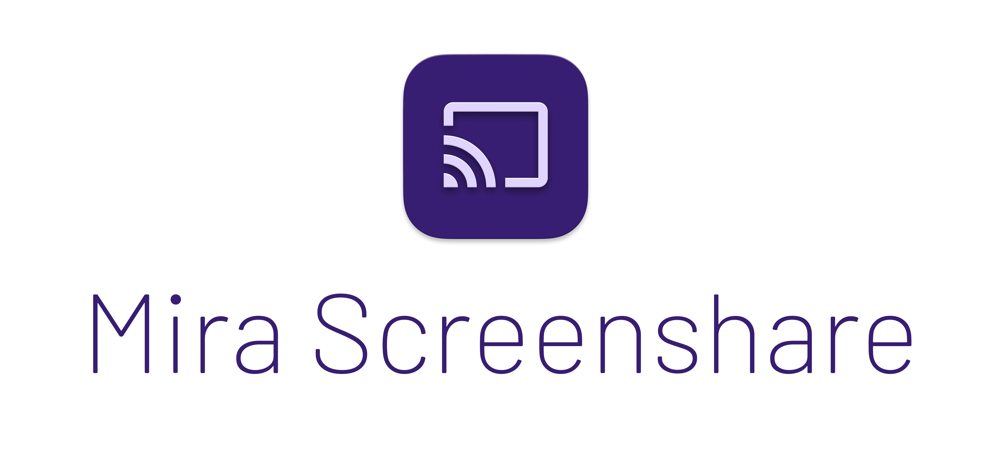

<!-- PROJECT LOGO -->
 

  

  <h3 align="center">Mira Screenshare</h3>

  

    A high-performance screen-sharing / remote collaboration software written in Rust.
  

[![Rust][rust-shield]][github-url]
[![Stargazers][stars-shield]][stars-url]
[![MIT License][license-shield]][license-url]

## Introduction

[![Screenshot]][github-url]

Currently this project is completely free and open-source. We have hosted a TURN server and a signalling server for public use, though we cannot make any guarantees about their availability or performance.
The viewer client is available at [mirashare.app][viewer-page].

You may also choose to host your own viewer and signalling server so everything is under your control.

At this stage, we do not recommend using it for any sensitive or mission-critical applications. Contributions are welcome.

## Downloads

Pre-compiled binaries for macOS (aarch64 / x86-64) and Windows are available for download at the [releases page][release-url].

## Features

* High performance screen capturing and streaming
* Remote mouse and keyboard control
* System audio capturing
* Cross-platform (macOS, Windows)
* Concurrent viewers support

## Performance
* 60 FPS encoding at 4K resolution
* 110 ms E2E latency

## Technical Details

Mira is built on top of [the WebRTC stack][webrtc], and consists of three parts, namely the sharer
client, the viewer client, and the signalling server.

* The [sharer client][github-url] will be responsible for capturing
and streaming the screen directly to the viewer(s) through a P2P connection.
    - if your Internet environment does not permit such a P2P connection to be established, a TURN server is required to relay the data.
* The [viewer][viewer-url] can dispatch
input (e.g. keyboard, mouse events) to the sharer to achieve control of the sharer's operating system.
* The [signalling server][signaller-url] is reponsible for peer discovery and initial connection negotiations.

For screen capturing, we use `Windows.Graphics.Capture` on Windows, and `ScreenCaptureKit` on macOS. This requires at least Windows 10 v1803 and macOS 13.0.

For encoding, by default x264 is used, however you can use other codecs/encoder or adjust its settings (quality, speed, compression, etc.) in the configuration file, `config.toml`.

## Q & A
Q. Can you see my screens?

A. No, we cannot see your screens. In an ideal environment, the data is transmitted directly from the sharer to the viewer(s), and the signaller is only used for initial connection negotiation. We do not have access to the data.
Even when a direct connection cannot be established, the data is relayed through a TURN server, and is encrypted with the WebRTC stack (e.g. Secure Real Time Protocol (SRTP)).

However, if you are still concerned, you could host your own signalling server and TURN server, and use the viewer client from the source code.

Q. Do you collect any data from me?

A. The signalling server we host does collect some metrics such as the number/length of sessions and the number of unique users estimated through your hashed IP address (salted and hashed with argon2). However, we do not collect any personal data. We do not have access to the data transmitted between the sharer and the viewer(s).

## Build
You need to have ffmpeg installed.

* For macOS, you could use `brew install ffmpeg`.
* For Windows, you need to download ffmpeg from [here](https://github.com/BtbN/FFmpeg-Builds/releases).
Make sure you download a shared library build such as `ffmpeg-master-latest-win64-gpl-shared.zip`.
Put it under `.\third_party\ffmpeg` so you have e.g. `.\third_party\ffmpeg\bin\ffmpeg.exe`.
Then copy over all dlls under `ffmpeg\bin` to `.` (working directory).

Then, simply run `cargo run --release`.

## Configure
Configuration file is by default `config.toml`. There are preset configs in `configs/` directory that you could use
as a starting point.

## License

GPLv3

Note that files under `src/capture/macos` are also dual-licensed under MIT.

## Attributions
* Some code is adapted from [scrap](https://github.com/quadrupleslap/scrap), which is licensed under the MIT license.
* Some code from [MirrorX](https://github.com/MirrorX-Desktop/MirrorX), licensed under GPLv3.

[release-url]: https://github.com/mira-screen-share/sharer/releases
[webrtc]: https://webrtc.org/
[screenshot]: resources/screenshot.png
[github-url]: https://github.com/mira-screen-share/sharer
[viewer-url]: https://github.com/mira-screen-share/viewer
[signaller-url]: https://github.com/mira-screen-share/signaller
[viewer-page]: https://mirashare.app/
[rust-shield]: https://img.shields.io/badge/Lang-Rust-EF7B3C?style=for-the-badge
[stars-shield]: https://img.shields.io/github/stars/mira-screen-share/sharer?style=for-the-badge
[stars-url]: https://github.com/mira-screen-share/sharer/stargazers
[license-shield]: https://img.shields.io/github/license/mira-screen-share/sharer.svg?style=for-the-badge
[license-url]: https://github.com/mira-screen-share/sharer/blob/master/LICENSE.txt